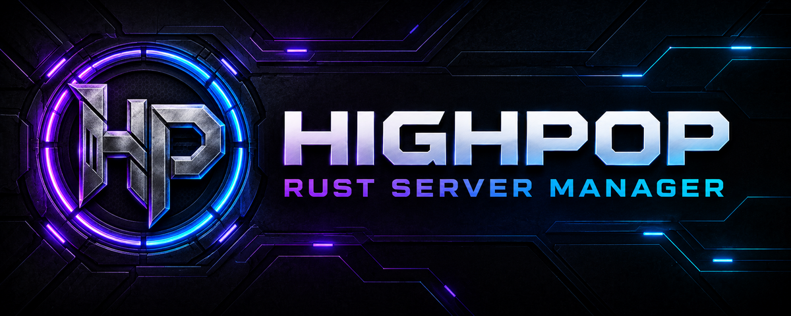

<p align="center">
  
</p>

<p align="center">
  Native, portable Windows management for dedicated Rust servers.
</p>

<p align="center">
  
  
  
  
</p>

HighPop Rust Manager is a local-first control panel built specifically for Rust Dedicated Server. It installs and maintains independent server instances, keeps them online, exposes day-to-day administration in one interface, and does not require a hosted account or subscription.

## What HighPop provides

| Area | Capabilities |
|---|---|
| Server setup | SteamCMD bootstrap, Rust install/validate/update, independent server folders, templates, editable Game/Query/WebRCON/Rust+ ports, and collision checks |
| Lifecycle | Start, safe stop, force stop, restart, auto-start, always-on recovery, crash-loop protection, verified process reattachment, and durable operation history |
| Console and players | Facepunch WebRCON, reconnect handling, filtered live console, export, player sessions, kick, timed/permanent bans, notes, whitelist permissions, and bulk moderation |
| Rust configuration | `server.cfg` variables, browser tags, Steam branch selection, custom maps, log paths, presets, launch arguments, CPU affinity, priority, and optional RAM limits |
| Mods | Oxide/uMod and Carbon installation/detection, framework-aware folders, plugin/config inventory, live plugin reload, and verified RogueRust Stable/Testing channels |
| Backups and wipes | Full and incremental ZIP backups, retention, pre-wipe safety backups, path-safe restore, map wipe, and full wipe |
| Automation | Once, daily, weekly, and repeating schedules for lifecycle, update, backup, wipe, broadcast, and console actions |
| Monitoring | CPU, memory, network, players, readiness signals, health checks, log watches, crash-risk warnings, local telemetry, and support bundles with secret redaction |
| Remote operations | Optional token-protected REST API and dashboard, Discord status/admin controls, webhooks, SMTP notifications, and multi-machine views |
| Windows integration | Portable storage, system tray, per-user logon task, Windows Explorer shortcuts, firewall rules, and optional UPnP mappings |
| Application updates | Startup release check and install prompt, four-hour background checks, manual About-page check, SHA-256 verification, in-place replacement, and automatic restart |

## Install

1. Download the Windows x64 ZIP from [Releases](../../releases).
2. Verify the matching SHA-256 file when provided.
3. Extract the complete `HPRM` folder to a writable location.
4. Run `HighPop.exe`, add a server, review its four ports, and select **Install**.

The application is self-contained; a separate .NET runtime is not required. Windows SmartScreen may warn for unsigned community builds. Administrator rights are only required for system-wide firewall or URL ACL changes.

## Portable layout

The release ZIP contains only the application, its assets, and release history:

```text
HPRM/
├─ HighPop.exe
├─ CHANGELOG.md
└─ assets/
   ├─ README.txt
   └─ presets/
```

On first use, HighPop creates runtime data below `assets/` and managed servers below `HPRM/Servers/`:

```text
HPRM/
├─ Servers/          # one independent Rust installation per profile
└─ assets/
   ├─ data/          # settings, profiles, schedules, databases, SteamCMD, telemetry
   ├─ backups/       # full and incremental backups
   └─ logs/          # HighPop diagnostics
```

Keep `HighPop.exe`, `assets`, and `Servers` together when moving or backing up an installation. Secrets are protected with Windows DPAPI for the current Windows user and machine; do not publish `assets/data`.

## RogueRust release channels

Each server has its own RogueRust channel in **Server → Mods**:

- **Stable** is the default and is recommended for production servers.
- **Testing** follows the current RogueRust development build and is intended for development servers.

HighPop reads the selected public channel manifest, validates that it identifies the expected channel, accepts downloads only from the RogueRust public release repository, verifies the DLL's SHA-256, and installs it transactionally. Oxide/uMod uses `RustDedicated_Data/Managed`; Carbon uses `carbon/extensions`. Existing DLLs receive bounded rollback copies.

The selected manifest is also passed to the Rust process, keeping RogueRust self-update checks on that server's chosen channel. Stop Rust before changing the channel or installing the extension.

## Recommended production setup

- Give every profile a unique installation folder and unique Game, Query, WebRCON, and Rust+ ports.
- Leave **Always-on** enabled for production and enable **Auto-start** only when the server should launch with HighPop.
- Use Stable RogueRust on production and Testing only on a separate development profile.
- Configure automatic backups before enabling unattended updates or wipes.
- Use tray/background mode when HighPop must retain live console and process handles.
- Keep the remote API disabled unless it is protected by a trusted LAN, VPN, firewall allow-list, or HTTPS reverse proxy.

## Build from source

Requirements: Windows 10/Server 2019 or newer and the .NET 10 SDK.

```powershell
git clone https://github.com/RogueAssassin/HighPop-Rust-Manager.git
cd HighPop-Rust-Manager
dotnet restore HighPop.sln
dotnet build HighPop.sln -c Release
dotnet run --project HighPop.SmokeTests/HighPop.SmokeTests.csproj -c Release
./Build-HighPop.ps1
```

The build script creates the self-contained executable, minimal portable ZIP, checksums, and release manifest under `artifacts/`.

## Project information

- [Changelog](CHANGELOG.md) — version-by-version release history
- [Roadmap](ROADMAP.md) — planned reliability, maintenance, interface, telemetry, and service work
- [Security](SECURITY.md) — vulnerability reporting and deployment guidance
- [Contributing](CONTRIBUTING.md) — development workflow
- [Notice](NOTICE.md) — attribution and third-party notices

HighPop is an independent community project and is not affiliated with or endorsed by Facepunch Studios or Valve.

## License

MIT. See [LICENSE](LICENSE).
